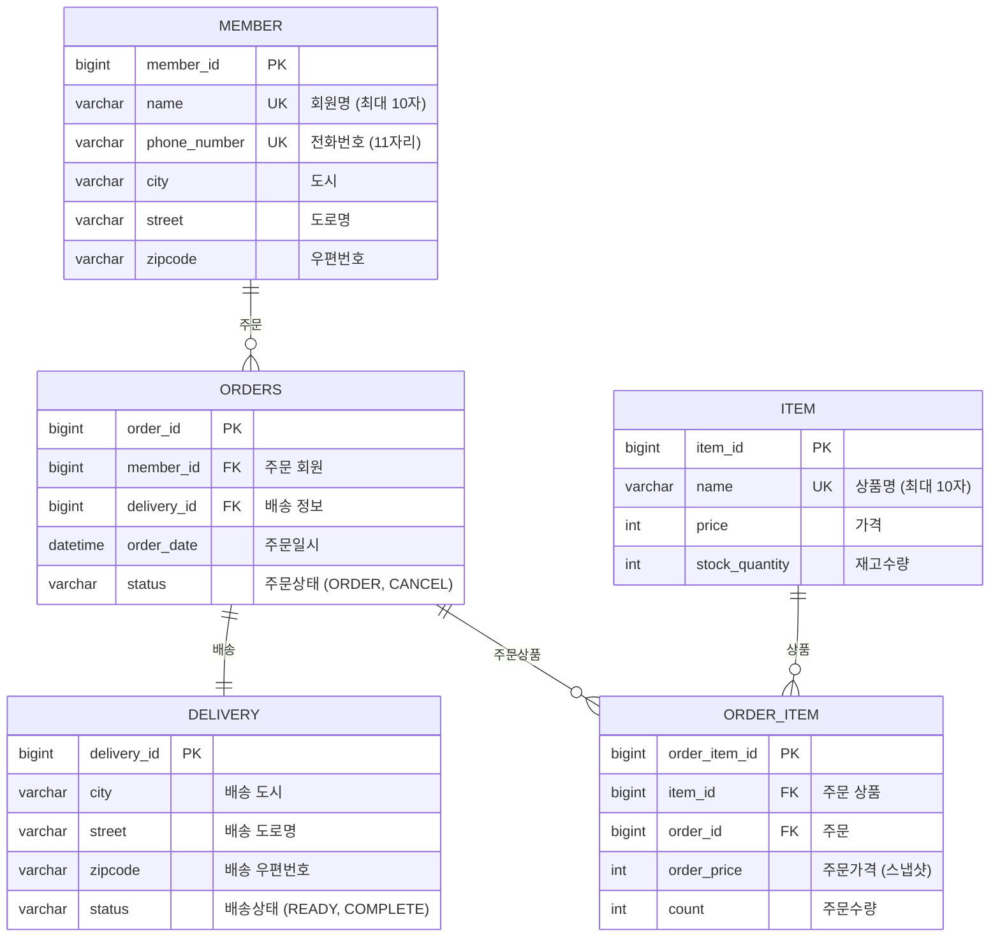
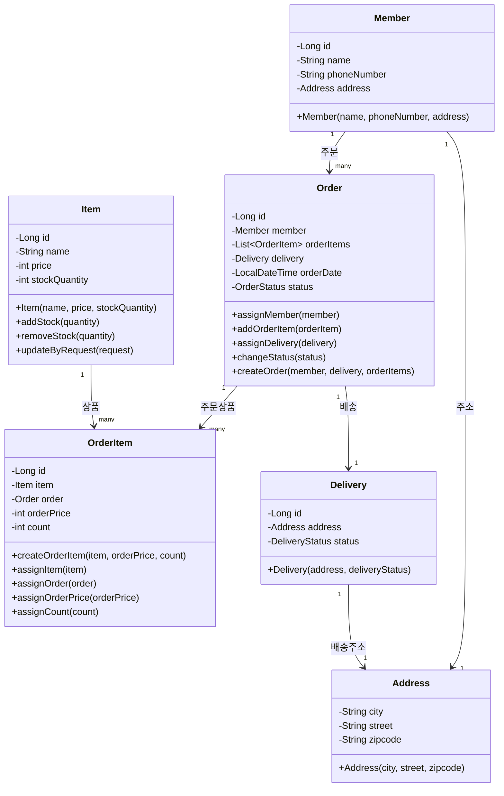

# ERP System

### 접속 URL
- **애플리케이션**: http://localhost:8080
- **Swagger UI**: http://localhost:8080/swagger-ui
- **H2 Console**: http://localhost:8080/h2
  - JDBC URL: `jdbc:h2:mem:test`
  - Username: `sa`
  - Password: (비어있음)

## 📊 데이터베이스 ERD

## 🏗️ Entity Class Diagram

## 📋 주요 기능

- **회원 관리**: 회원 등록, 조회
- **상품 관리**: 상품 등록, 수정, 조회, 재고 관리
- **주문 관리**: 주문 생성, 조회, 취소, 배송 관리

## 🔧 기술 스택

- **Backend**: Spring Boot 3.5.5, Java 17
- **Database**: H2 (개발용), JPA/Hibernate, MyBatis
- **API**: REST API, Swagger UI
- **Validation**: Jakarta Validation, MapStruct

## 📚 API 엔드포인트

### 회원 관리 (`/api/members`)
- `POST /api/members` - 회원 생성
- `GET /api/members` - 회원 목록 조회

### 상품 관리 (`/api/items`)
- `POST /api/items` - 상품 등록
- `GET /api/items` - 상품 목록 조회
- `PUT /api/items/{id}` - 상품 수정

### 주문 관리 (`/api/orders`)
- `POST /api/orders` - 주문 생성
- `GET /api/orders` - 주문 목록 조회
- `DELETE /api/orders/{id}` - 주문 취소
